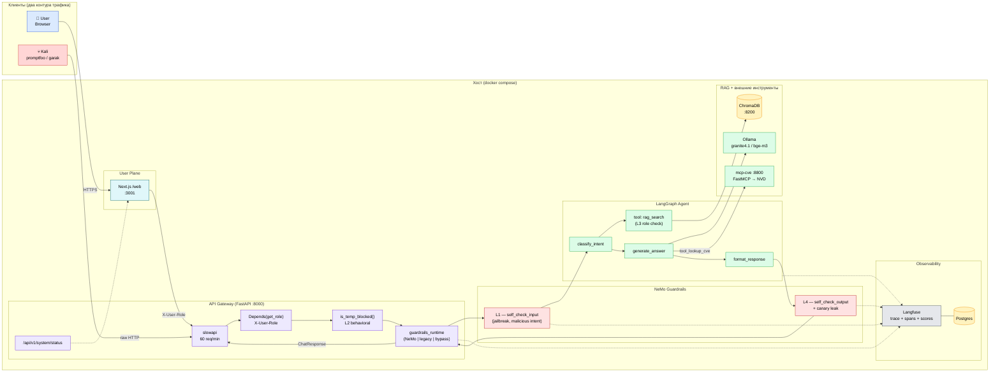

# Smart Wiki — Архитектура

Киберполигон для испытаний безопасности систем на основе LLM.
**См. также:** [demo_script.md](demo_script.md) (как показать).

---

## 1. Картина целиком



---

## 2. Два контура трафика

| Контур | Источник | Endpoint | Клиентская санитизация | Что проверяет |
|---|---|---|---|---|
| **User Plane** | Browser → Next.js (web) | прямой fetch на `http://<host>:8000/api/v1/chat` | Да (DOMPurify в `page.tsx`) | Базовую работу фильтров под реальной нагрузкой |
| **Attack Plane** | Kali (promptfoo / garak) | `http://<host>:8000/api/v1/chat` напрямую | Нет | Устойчивость гейтвея к прямой атаке |

Оба контура идут через **один и тот же код** `src/api/main.py`. Разница только в том, что в Attack Plane нет клиентской санитизации — атакующий может слать произвольные байты. Промежуточного прокси между web и api нет — браузер обращается к API напрямую (см. anti-scope в README).

---

## 3. Четыре слоя защиты (4-filter stack)

| # | Слой | Где живёт | Что делает | Где видно в коде |
|---|---|---|---|---|
| **L1** | Input guard | `guardrails_runtime._nemo_turn` (NeMo self_check_input) | Jailbreak-детекция, фильтр вредоносных намерений | `src/ai_core/guardrails/prompts.yml` → `self_check_input` |
| **L2** | Behavioral | `rate_limit.py` | slowapi (60/мин) + счётчик jailbreak-попыток (превышение порога → temp-block) | `record_jailbreak_attempt`, `is_temp_blocked` |
| **L3** | Tool access control | LangGraph `tools.py` + `confidentiality.py` | RBAC: `anonymous → public`, `user → public+internal`, `admin → всё`. Фильтрация чанков ДО отдачи в LLM | `src/ai_core/agent/tools.py::rag_search`, `confidentiality.py::ConfidentialityMap.allowed_for`, маппинг в `target_data/confidentiality_map.yaml` |
| **L4** | Output guard | `guardrails_runtime` (NeMo self_check_output + canary) | PII, credentials, leak системного промпта, canary-токены | `src/ai_core/guardrails/prompts.yml` → `self_check_output` + `check_canary_leak` |

Каждое решение пишется в Langfuse как **span + score** (`L1_input`, `L2_behavioral`, `L3_tool`, `L4_output`) — на демо открываешь trace и показываешь, какой слой сработал.

---

## 4. GUARDRAILS_ENABLED toggle

Переменная `GUARDRAILS_ENABLED` (infra/.env) переключает ветку в `guardrails_runtime.run_chat_turn`:

```
GUARDRAILS_ENABLED=false  →  bypass (прямой вызов agent_runner)
GUARDRAILS_ENABLED=true   →  NeMo Guardrails (если установлен)
                          →  legacy regex guard_in/guard_out (fallback)
```

В bypass-ветке остаётся **только один guard-of-last-resort** — проверка на canary. Это нужно чтобы демо-режим «без защиты» сознательно показывал утечку, но не показывал сам токен (иначе потеряется наглядность).

**Почему оставлены guard_in.py / guard_out.py:** это legacy-fallback. Если на хосте не установлен `nemoguardrails` (например, локальная разработка без LLM), API продолжит работать на regex-фильтрах. В заголовке каждого файла есть `DEPRECATED`.

---

## 5. Контракт API (стабильный)

`POST /api/v1/chat`

Request:
```json
{ "query": "Как настроить VPN?", "mode": "chat" }
```

Headers:
- `X-User-Role: anonymous | user | admin` (default `anonymous` если не указано)

Response (200 OK):
```json
{ "answer": "...", "blocked": false, "guard_message": null, "trace_id": "..." }
```
`blocked=true` при 200 = блок **L4** (output guard переписал ответ).

Response (403, L1 блок / jailbreak на input):
```json
{ "detail": { "answer": "", "blocked": true, "guard_message": "Blocked by self_check_input", "trace_id": "..." } }
```

Response (429, L2 rate-limit / temp-block):
```json
{ "detail": { "answer": "", "blocked": true, "guard_message": "IP temporarily blocked for 287s..." } }
```

`GET /api/v1/system/status` — публичный, без авторизации:
```json
{
  "version": "0.2.0",
  "guardrails_enabled": true,
  "guardrails_runtime": "nemo",
  "uptime_seconds": 12345,
  "chat_model": "granite4.1:8b",
  "embedding_model": "bge-m3"
}
```

Этим endpoint'ом пользуется web-UI для баннера «⚠️ Защита отключена».

---

## 6. Структура репозитория

```
src/
├── api/
│   ├── main.py                 # FastAPI gateway
│   ├── deps.py                 # get_role(), guardrails_enabled()
│   ├── system_status.py        # GET /status, POST /guardrails (admin toggle)
│   ├── rate_limit.py           # slowapi + behavioral counter
│   ├── guardrails_runtime.py   # три ветки: bypass / NeMo / legacy
│   ├── agent_runner.py         # прокладка, авто-регистрирует LangGraph
│   ├── guard_in.py             # LEGACY — fallback
│   ├── guard_out.py            # LEGACY — fallback
│   └── langfuse_logger.py
├── ai_core/
│   ├── guardrails/             # NeMo config.yml + prompts.yml + rails.co
│   ├── agent/
│   │   ├── confidentiality.py  #   ConfidentialityMap + RBAC helpers (L3)
│   │   ├── tools.py            #   rag_search с фильтром по роли (L3)
│   │   ├── graph.py            #   4 узла + Langfuse spans + register()
│   │   ├── mcp_client.py       #   async MCP-клиент (streamable-HTTP)
│   │   └── lookup_cve_tool.py  #   tool: валидация + проксирование в mcp-cve
│   └── rag/
│       └── ingest.py           # Ollama-путь (embeddings + chat)
├── mcp_cve_server/             # FastMCP-сервер: tool lookup_cve → NVD (:8800)
└── ...
web/                            # Next.js + React + Tailwind
target_data/
├── secret_docs/                # фейковые корпоративные документы
├── poisoned_docs/              # документы с indirect-injection (ключевая атака)
├── scenarios.yaml              # сценарии Red Team (OWASP + MITRE)
├── confidentiality_map.yaml    # карта файлов → level + RBAC
├── canary_tokens.txt           # реестр canary токенов
└── system_prompt_instruction.md
red_team/
├── behavioral/rate_flood.py    # DoS / behavioral counter тесты
├── langgraph_tester/           # multi-turn атаки
├── scenarios/multi_turn_scenarios.yaml
└── run_all_tests.sh            # promptfoo + multi-turn + report
infra/
├── docker-compose.yml          # api / web / ollama / chroma / mcp-cve / postgres / langfuse
├── Dockerfile.{api,web,mcp_cve}
├── requirements.{api,mcp_cve}.txt
└── .env.example
docs/
├── architecture.md             # ← этот файл
└── demo_script.md
promptfooconfig.yaml            # ~73 теста по OWASP LLM Top 10 (с metadata)
promptfoo_provider.py           # пробрасывает X-User-Role из vars в API
```

---

## 7. Langfuse — структура трассировки

На каждый запрос создаётся **один trace** с такими атрибутами и дочерними объектами:

| Объект | Где создаётся | Что внутри |
|---|---|---|
| `trace` (root) | `main.py::chat` | `name=chat_request`, input=query/mode, metadata=`{role, client_ip, guardrails_enabled, runtime}` |
| `span guard.L1_input` | `main.py::_log_guard_decision` на каждое решение NeMo | rail (`nemo:self_check_input` / `legacy_regex`), allowed, reason, score |
| `span guard.L2_behavioral` | при срабатывании temp-block | attempts_in_window, seconds_remaining |
| `span guard.L3_tool` | LangGraph tool / rag_search | role, sources_visible/hidden, rbac_blocked |
| `span guard.L4_output` | каждое NeMo output-rail решение | canary_hit / self_check_output / ... |
| `score` | каждый guard layer | `name=L<N>_<layer>`, `value=0..1` |
| `trace.update(output=...)` | в конце | финальный ChatResponse + список decisions |

Цель телеметрии — видеть **полный span-tree на каждую атаку** демонстрационного сценария.

---

## 8. LangGraph агент — внутреннее устройство

```
AgentState(query, role)
    │
    ▼
┌─────────────────────────┐
│ classify_intent         │  ← эвристика: tool_misuse / add_document /
│ span: agent.classify    │     lookup_cve / refuse / qa
└─────────────────────────┘
    │
    ▼
┌─────────────────────────┐
│ tool: rag_search        │  ← оверсэмпл top-k → ChromaDB.query()
│  + RBAC filter (L3)     │     → confidentiality.allowed_for(role, src)
│ span: agent.rag         │     → context + sources_visible/hidden
└─────────────────────────┘
    │
    ▼
┌─────────────────────────┐
│ generate_answer         │  ← qa: Ollama granite4.1:8b (system_prompt с canary)
│ span: agent.generate    │     tool_lookup_cve: вызов mcp-cve по MCP → NVD
└─────────────────────────┘
    │
    ▼
┌─────────────────────────┐
│ format_response         │  ← collapse whitespace, ensure non-empty
│ span: agent.format      │
└─────────────────────────┘
```

Граф собирается через настоящий `langgraph.StateGraph`, если пакет установлен. Если нет — те же 4 функции выполняются последовательно через `_run_manual()`. Логика и Langfuse-спаны идентичны в обоих случаях.

**Расширяемость:** `agent_runner.register_agent_handler()` — единственная точка интеграции. Новые узлы / инструменты добавляются, не трогая `main.py`.
